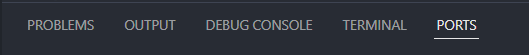
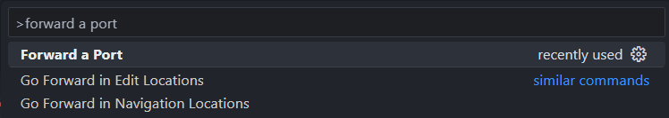
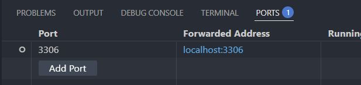

# Forwarding ports to CSCT Cloud
Different services are hosted on specific ports on the server, for example the MySQL server accessed in a number of modules is available on port 3306. For security, these ports and services are not openly accessible from outside the server, and so to be able to access them we need to use *port forwarding* to securely pass traffic from your local computer to the service running on the server.

This process uses an SSH tunnel, which is created when you connect to the server using SSH, to securely send and receive data with the ports you've forwarded. You will only be able to access these ports on the server when you have an active SSH connection to it, either through Visual Studio Code or through a terminal session.

# Using Visual Studio Code
Access the *Ports* tab in the bottom pane:



If you can't see the ports tab, open it using the *Command Palette* (++ctrl+shift+p++ or ++cmd+shift+p++) and search *forward a port*:



In the *Ports* tab, press the *Forward a Port* button (or the *Add Port* button if you already have other ports forwarded). Type the port number in the *Port number or address* box - for MySQL you want to use 3306 - then press ++return++ to save:



# Using SSH in a terminal
When connecting using the terminal, we can specify ports we want forwarded as arguments to the SSH connection command.

The `-L` flag is used to forward a port accessible on the server to a port on your local machine, using the format `<local port>:<remote host>:<remote port>`. Remote host in this case is from the perspective of the server, so we would use `localhost` for services running on CSCT Cloud itself, and would normally use the same number for the local port and remote port.

!!! example
    To forward port 3306, used to access the MySQL server, we would add `-L 3306:localhost:3306` to the connection string.

    The full connection command would then be:
    ``` bash
    ssh -L 3306:localhost:3306 <UWE email address>@csctcloud.uwe.ac.uk
    ```

# In your SSH configuration file
If you have your connection setup in an SSH configuration file, you can use the `LocalForward` directive to have ports forwarded everytime you connect.

!!! example
    To forward port 3306 you would add `LocalForward 3306 localhost:3306` to your CSCT Cloud host block, like so:

    ``` 
    Host csctcloud.uwe.ac.uk
        Hostname csctcloud.uwe.ac.uk
        User <UWE email address>
        LocalForward 3306 localhost:3306
    ```