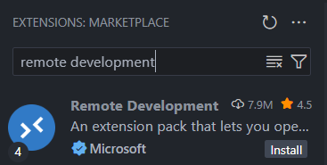
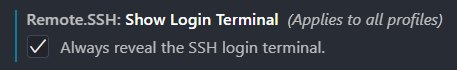
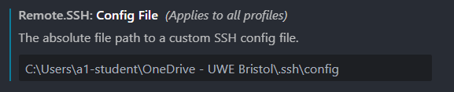
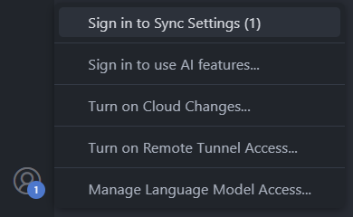
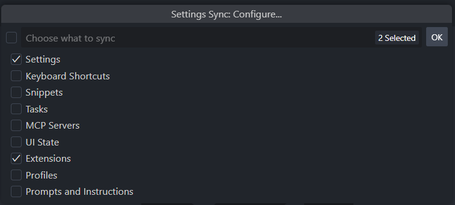
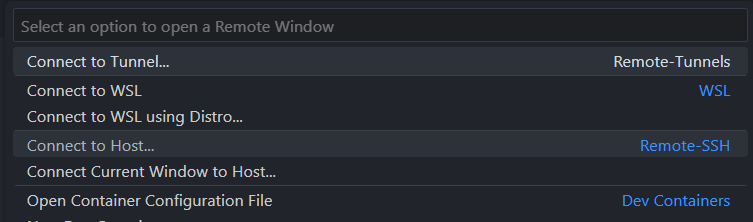
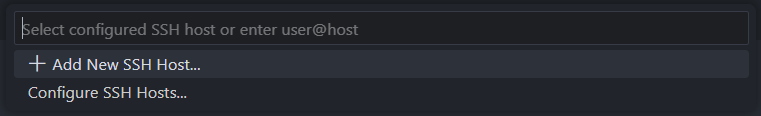
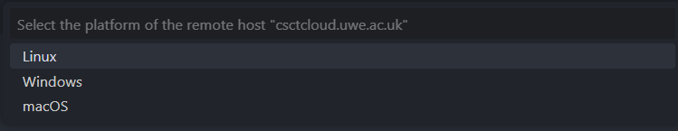
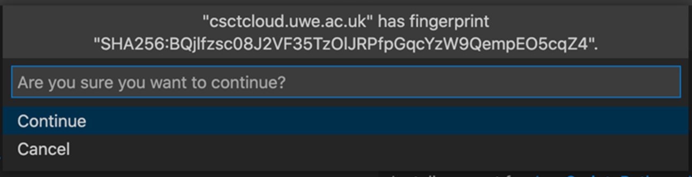

# Connect to the server using Visual Studio Code
Visual Studio Code is a cross-platform text editor built on open-source technologies, which you can use to write, edit, and run code on CSCT Cloud.

## Install Visual Studio Code
!!! tip "UWE lab computers"
    Visual Studio Code is already installed on lab computers, if you're using one skip ahead to the next step to configure it.

If you don't already have Visual Studio Code installed, you can download the relevent installer for your platform from the Microsoft website.

[Download Visual Studio Code installer](https://code.visualstudio.com/){ .md-button }

## Configure Visual Studio Code
Before we can setup a connection to the server we need to install and configure the Remote Development extensions.

### Install extensions
Open the Extensions tab from the toolbar on the left hand side (or use ++ctrl+shift+x++ / ++cmd+shift+x++). Search for `remote development` in the box at the top (*Search Extensions in Marketplace*), select the first option - this will have a verified tick with Microsoft next to it.



Press *Install* to install the extensions.

### Configure extension settings
Once installed we have to configure some of the extension's settings. Open up the Settings page with ++ctrl+comma++ (or ++cmd+comma++ on a mac), or by navigating from the file menu (*File > Preferences > Settings*).

In the *Search Settings* box search for `Remote.SSH: Show Login Terminal` and tick the box to enable the setting. This will allow you to provide inputs (like entering your SSH key passphrase) using the terminal.



!!! tip "UWE lab computers"
    We need to instruct the Remote Development extension to store the SSH configuration file on OneDrive.

    In the *Search Settings* box search for `Remote.SSH: Config File` then enter the path:
    ``` text
    C:\Users\<username>\OneDrive - UWE Bristol\.ssh\config
    ```

    Replacing `<username>` with the username you login to UWE computers with.

    !!! example
        If your UWE username was `a1-student` you would enter the path:
        ``` { .text .no-copy }
        C:\Users\a1-student\OneDrive - UWE Bristol\.ssh\config
        ```

    The setting should look like this:

    

### Turn on Settings Sync
Visual Studio Code can syncronise all the settings and extensions you setup across different computers, using *Settings Sync*. You don't need to use this if you're only going to be using your own personal computer, but you will need to set this up if using UWE lab computers.

In the bottom-left corner of Visual Studio Code click the profile icon (an outline of a head) and select *Sign in to Sync Settings*.



Choose *Sign in with Microsoft*, this will open up an account login window. Choose your UWE account (or enter your UWE email address) and password. Once logged in you can close the browser window.

If you are asked which settings you want to sync, make sure you select the *Settings* and *Extensions* options; you might want to select more, but these are the minimum needed.



!!! tip "UWE lab computers"
    You will need to sign in to Settings Sync every time you use Visual Studio Code on a new lab computer, so that it's setup to use your SSH configuration file and keys stored on OneDrive.

## Setup a new connection
We can now setup the Remote Connection extension to connect to CSCT Cloud. Start by clicking the Remote Connection button in the bottom left corner of Visual Studio Code: 

Select the option to *Connect to host...*



### Add an SSH host
Select the option to *Add New SSH Host...*



When prompted to `Enter SSH Connection Command` use the same command you used before to connect to the server using the terminal.

``` bash
ssh <UWE email address>@csctcloud.uwe.ac.uk
```

Replacing `<UWE email address>` with your full UWE email address, making sure it is completely in lowercase, then press ++return++ to confirm your input.

!!! example
    If your email address was `A.Student@live.uwe.ac.uk` you would enter the connection command:

    ``` { .bash .no-copy }
    ssh a.student@live.uwe.ac.uk@csctcloud.uwe.ac.uk
    ```

    

!!! tip "UWE lab computers"
    When prompted to enter an SSH connection command, use the modified version below to reference your public key stored on OneDrive:

    ``` bash
    ssh -i 'OneDrive - UWE Bristol\.ssh\id_rsa' <UWE email address>@csctcloud.uwe.ac.uk
    ```

    !!! example
        If your email address was `A.Student@live.uwe.ac.uk` you would enter the connection command:

        ``` { .bash .no-copy }
        ssh -i 'OneDrive - UWE Bristol\.ssh\id_rsa' a.student@live.uwe.ac.uk@csctcloud.uwe.ac.uk
        ```

    If prompted to `Edit custom SSH configuration file` just press ++return++.

### Connect to CSCT Cloud
Start by again clicking the Remote Connection button in the bottom left corner of Visual Studio Code: 

Select the option to *Connect to host...* and choose the host we just added (csctcloud.uwe.ac.uk):


This will launch a new Visual Studio Code window which will initiate a connection to the server. The first time you connect you'll be asked to *Select the platform of the remote host*, in our case this is Linux.



If you are asked to confirm the fingerprint of the server, select continue.



Visual Studio Code will now start setting up the remote environment, this process may take a couple of minutes the first time you connect to the server using Visual Studio Code. If you set a passphrase on your SSH key when you generated it earlier you'll be asked to enter this, the process will then continue. 

Once the setup process finishes Visual Studio Code is now ready for you to work remotely on the server.

## Interacting with the server
Once you're connected to the server you can use Visual Studio Code in exactly the same way you would when using it on your local computer.

The *Explorer* tab will let you open folders within your home directory on the server which you can create new directories and files to work in, and you can launch a new terminal window within Visual Studio Code using the *Terminal* menu at the top.

If you're completely new to using Visual Studio Code, have a look at the [Official Beginner Tutorial](https://www.youtube.com/watch?v=B-s71n0dHUk){:target="_blank"} from Microsoft to get started.

### Common tasks
Depending on which modules you're taking, there are different tasks you'll use Visual Studio Code to do on the server, including:

* Creating Python virtual environments, installing Python packages, and running Python code.
* Forwarding ports, so you can access services such as MySQL on the server.
* You can run Visual Studio Code extensions on the server which will let you interact with SQL and NoSQL databases.
* You can run Python Flask apps and view the output on your local web browser.

Your modules will introduce you to these when you need them.

## Closing a Remote Connection
When you have finished working you should close the remote connection by clicking the Remote Connection button in the bottom left of Visual Studio Code, and choosing the *Close Remote Connection* option.