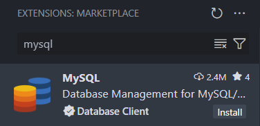
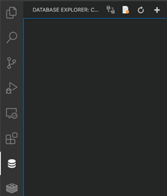
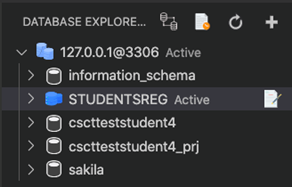

# Using MySQL with a graphical interface (GUI)
There are several Graphical User Interface (GUI) applications that can be used to work with databases hosted on CSCT Cloud, including the MySQL extension for Visual Studio Code, and MySQL Workbench.

## Visual Studio Code
The MySQL extension for Visual Studio Code allows you to interact with a variety of SQL and NoSQL database servers. We'll be using the free version - this only allows you to use a subset of these servers, and only setup three connections, but this is more than enough for working on CSCT Cloud.

### Install extension
Open the Extensions tab on the left hand side (or with ++ctrl+shift+x++ or ++cmd+shift+x++) and search for *mysql*, choose the extension with the *Database Client* verified tick and click install:

Once the extension is installed it will add two new icons to the left hand menu - one is for SQL databases, the other is for NoSQL databases:

 **Database** - used to explore SQL databases (e.g. MySQL, PostgreSQL)

 **NoSQL** - used to explore NoSQL databases (e.g. MongoDB)

Click on the *Database* icon and a new blank explorer window will appear:

### Add a connection
Click the *Add Connection* icon (top right of the explorer window) and the *Connect to server* page will appear for you to enter connection details to:

* Connection Name (optional): CSCT Cloud
* Host: 127.0.0.1
* Port: 3306
* Username: [your database account username](./login.md)
* Password: [the password you set](./login.md#changing-your-password)

Once you click the *Connect* button, your connection with the server should be established and you should be able to see MySQL databases which you have the appropriate permissions to access:

## MySQL Workbench
MySQL Workbench is another GUI application for interacting with databases which can be installed on your local computer. It has several features such as importing and exporting data; query editor; forms; entity relation modeller.

It is available from MySQL, and supports Windows, macOS, and some Linux distributions. It is also available through [AppsAnywhere](https://appsanywhere.uwe.ac.uk/login){:target="_blank"}.

### Install Workbench
Download the MySQL Workbench installer from the MySQL website. If you're using a mac, make sure you download the correct version for your CPU architecture: `ARM` if you have an Apple chip (M1, M2 etc.) and `x86` if you have an Intel chip.

[Install MySQL Workbench](https://dev.mysql.com/downloads/workbench/){target="_blank" .md-button}

If you're asked to *Login* or *Sign Up for an Oracle Web account*, ignore both of these options and select *No thanks, just start my download.* further down to begin the download.

Once installed, launch MySQL Workbench.

### Add a connection
To add a connection, select the ++plus++ icon next to MySQL connections on the welcome screen.

This will enter a new window for you to enter connection parameters, fill out these details:

* Connection Name: CSCT Cloud
* Hostname: 127.0.0.1
* Port: 3306
* Username: [your database account username](./login.md)

!!! note
    You will need to setup [Port Forwarding](../additional/port-forwarding.md) to be able to connect MySQL Workbench, installed on your local computer, to CSCT Cloud.

    Make sure port `3306` has been forwarded to be able use MySQL workbench.

Once you press OK this connection will be added to your connections list. Click on your connection and enter the [database account password you set](./login.md#changing-your-password) to connect.